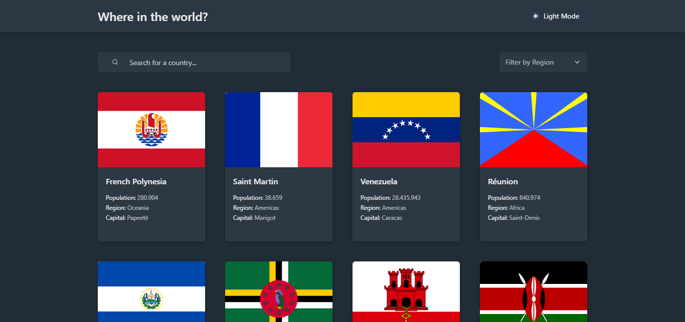
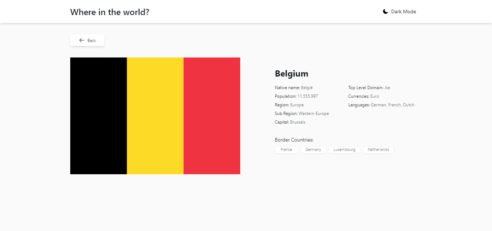

# Frontend Mentor - REST Countries API with color theme switcher solution
This is a solution to the [REST Countries API with color theme switcher challenge on Frontend Mentor](https://www.frontendmentor.io/challenges/rest-countries-api-with-color-theme-switcher-5cacc469fec04111f7b848ca). Frontend Mentor challenges help you improve your coding skills by building realistic projects. 

## Table of contents
- [Overview](#overview)
  - [The challenge](#the-challenge)
  - [Screenshot](#screenshot)
  - [Links](#links)
- [My process](#my-process)
  - [Built with](#built-with)
  - [What I learned](#what-i-learned)
  - [Useful resources](#useful-resources)
- [Author](#author)

## Overview

### The challenge
Users should be able to:

- See all countries from the API on the homepage
- Search for a country using an `input` field
- Filter countries by region
- Click on a country to see more detailed information on a separate page
- Click through to the border countries on the detail page
- Toggle the color scheme between light and dark mode *(optional)*

### Screenshot

### Screenshot 1

### Screenshot 2

### Links
- Solution URL: [Github Repository](https://github.com/RafaelSS427/rest-countries-api)
- Live Site URL: [Go to live site](https://rafaelss427.github.io/rest-countries-api)

## My process

### Built with
- Mobile-first workflow
- [Next.js](https://nextjs.org/) - React framework
- [TailwindCSS](https://tailwindcss.com/) - For styles
- [NextUI](https://nextui.org/) - React UI library
- [SWR](https://swr.vercel.app/) - Data Fetching
- [Zustand](https://zustand-demo.pmnd.rs/) - For state management
- [next-themes](https://www.npmjs.com/package/next-themes) - For the themes

### What I learned
In this challenge I have improved the management of user interfaces in situations where attributes way very and I have learned about many features related to version 13 of next.js.

### Useful resources
I used the official documentation of each library.

## Author
- Website - [Rafael Sequeira Sandoval](https://www.rafael-sequeira-sandoval.dev)
- Frontend Mentor - [@RafaelSS427](https://www.frontendmentor.io/profile/RafaelSS427)